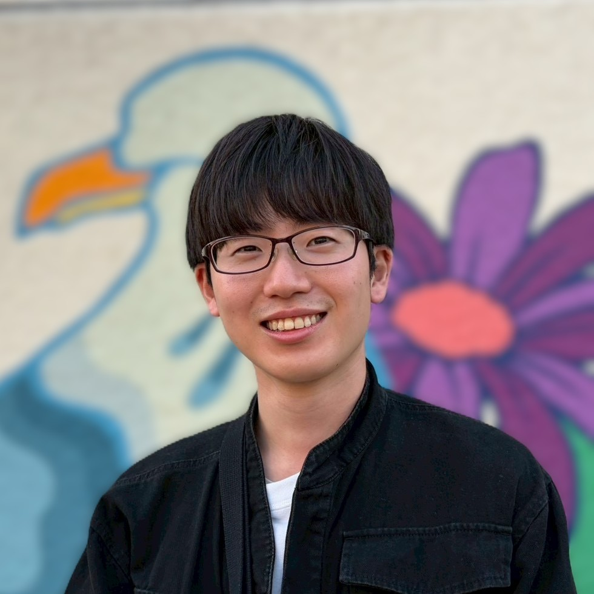

:::: {.hero}
::: {.hero-intro}
```{=html}
<header id="title-block-header" class="quarto-title-block default">
  <div class="quarto-title">
    <h1 class="title">Hiroki Yoshida （吉田 拓暉）</h1>
  </div>
</header>
```

[Theoretical condensed matter physicist]{.hero-subtitle}

I study quantum-geometric and symmetry-protected phenomena in topological and altermagnetic systems. My research focuses on nonlinear transport, Berry-phase effects, and quantization mechanisms in Weyl semimetals, using tight-binding modeling and symmetry-based analysis.

**Research interests:** quantum geometry · nonlinear transport · topological phases · altermagnetism · magnetoelastic phenomena

[Research](research.qmd) · [Publications](publications.qmd) · [CV](cv.qmd) · [Contact](contact.qmd)
:::

::: {.hero-portrait}
{fig-alt="Hiroki Yoshida"}
:::
::::

<div class="last-updated">
Last updated: September 29, 2026
</div>