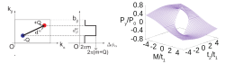
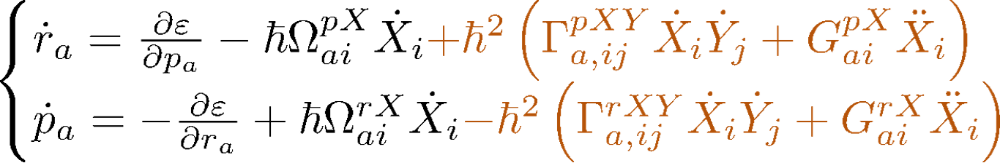
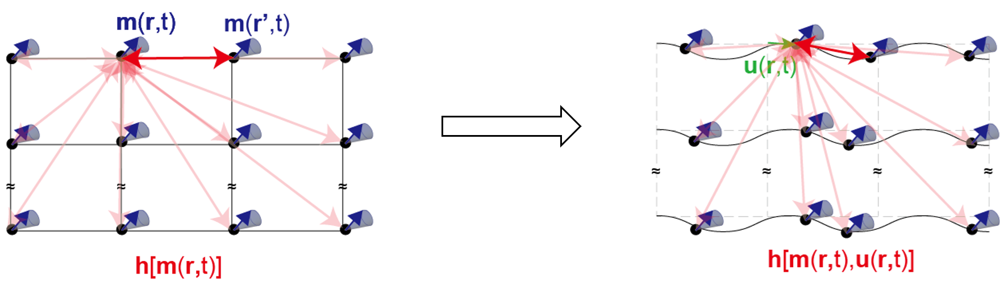

My research focuses on theoretical condensed matter physics, particularly the roles of quantum geometry, topology, and symmetry in transport and optical phenomena. I use tight-binding models, symmetry analysis, and semiclassical theory to explore these phenomena, with a particular interest in nonlinear responses.

## Altermagnets and optical effects

I investigate optical responses in altermagnets, with a focus on light-induced spin currents. Combining symmetry analysis with tight-binding models, my collaborators and I predict a spin-current analog of the quantized circular photogalvanic effect in altermagnetic Weyl semimetals. We identify symmetry conditions that allow this quantized response, providing a route to generating pure spin currents with circularly polarized light [@yoshida2026quantization].

::: {.research-figure}

:::

## Weyl semimetals

I study discontinuities in electric polarization between insulating states on opposite sides of a two-dimensional Weyl semimetal limit. My collaborators and I show that polarization jumps between topologically trivial insulators can be expressed in terms of the "Weyl dipole," which characterizes the distribution of Weyl nodes and their monopole charges in momentum space [@yoshida2023breaking]. We extend this analysis to topological phase transitions: the Weyl-dipole description applies to transitions in which the $\mathbb{Z}_2$ invariant changes, whereas transitions that change the Chern number require a formulation involving Weyl-node positions relative to a reference point in momentum space [@yoshida2023topological].

::: {.research-figure}

:::

## Quantum geometry

I explore how the geometry of electronic states shapes transport phenomena. Semiclassical wave-packet theory provides an intuitive framework for connecting this geometry to electron motion. By incorporating leading nonadiabatic corrections, my collaborator and I derive gravity-like terms in the equations of motion, described by Christoffel symbols constructed from the energy-weighted quantum metric. These terms can produce a transverse electrical response that we call the "emergent-gravity Hall effect" [@yoshida2025emergent].

::: {.research-figure}

:::

## Magnetoelastic waves

I also investigate coupled magnetic and elastic excitations in ferromagnetic thin films, focusing on magnetostatic waves—long-wavelength spin waves governed primarily by magnetic dipolar interactions. My collaborators and I develop a theoretical framework that accounts for how elastic deformations modify dipolar fields. This framework describes magnetoelastic coupling mediated by long-range dipolar interactions and predicts hybridization between magnetostatic waves and Lamb waves, the elastic modes of a thin plate [@yoshida2026magnetoelastic].

::: {.research-figure}

:::

## References

::: {#refs}
:::
